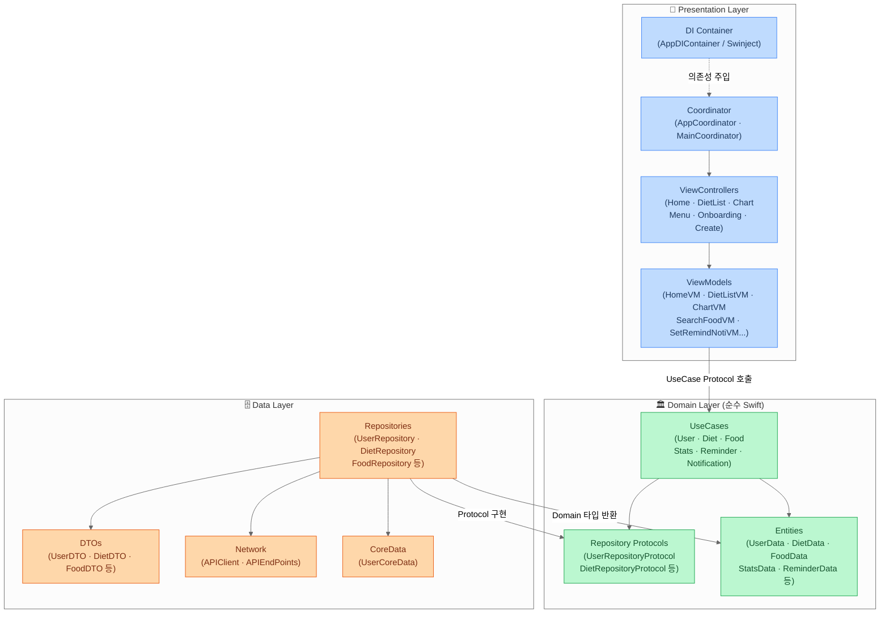

# BalanceEat

> 체중, 골격근량, 체지방률 기반 식단 기록 및 영양 목표 관리 iOS 앱

  

[](https://apps.apple.com/us/app/balanceeat/id6754953745)

<br>

## 스크린샷

| 홈 | 식단 내역 | 캘린더 |
|:---:|:---:|:---:|
|  |  |  |

| 식단 등록 | 음식 검색 | 통계 | 메뉴 |
|:---:|:---:|:---:|:---:|
|  |  |  |  |

| 목표 설정 | 알림 설정 |
|:---:|:---:|
|  |  |

<br>

## 기술 스택

| 분류 | 사용 기술 |
|------|----------|
| 언어 | Swift |
| UI | UIKit, SnapKit |
| 아키텍처 | MVVM + Clean Architecture + Coordinator Pattern |
| 반응형 | RxSwift, RxCocoa |
| 비동기 | async/await, @MainActor |
| 네트워크 | Alamofire |
| 로컬 저장소 | CoreData, UserDefaults |
| 의존성 주입 | Swinject |
| 푸시 알림 | Firebase Cloud Messaging (FCM) |
| 차트 | DGCharts |
| 테스트 | XCTest |

<br>

## 아키텍처



<br>

## 프로젝트 구조

```
BalanceEat/
├── AppDelegate.swift
├── SceneDelegate.swift
├── Coordinator/                # AppCoordinator, MainCoordinator
├── DI/                         # AppDIContainer (Swinject)
├── Core/
│   └── Presentation/
│       └── Components/         # 공통 UI 컴포넌트
├── Domain/
│   ├── Entities/
│   ├── Models/
│   ├── Repositories/           # Repository Protocols
│   └── UseCases/
├── Data/
│   ├── Network/                # APIClient, APIEndPoints
│   ├── Repository/
│   ├── DTOs/
│   └── CoreData/
├── Presentation/
│   ├── Base/                   # BaseViewController, BaseViewModel
│   ├── Onboarding/
│   ├── Create/                 # 식단 등록, 음식 검색/생성
│   └── Main/
│       ├── Home/
│       ├── List/               # 식단 캘린더
│       ├── Chart/              # 통계
│       └── Menu/               # 사용자 설정, 리마인더
├── Extension/
├── Resources/
└── Utils/
```
