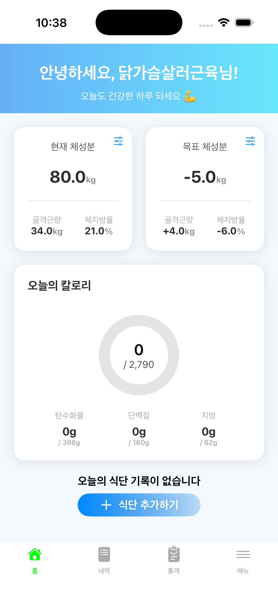
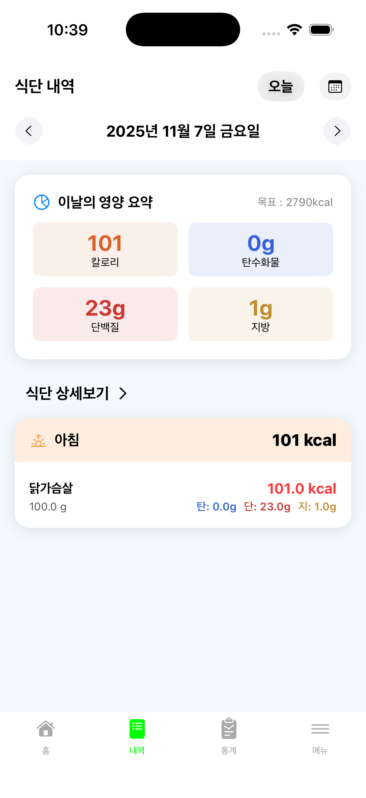
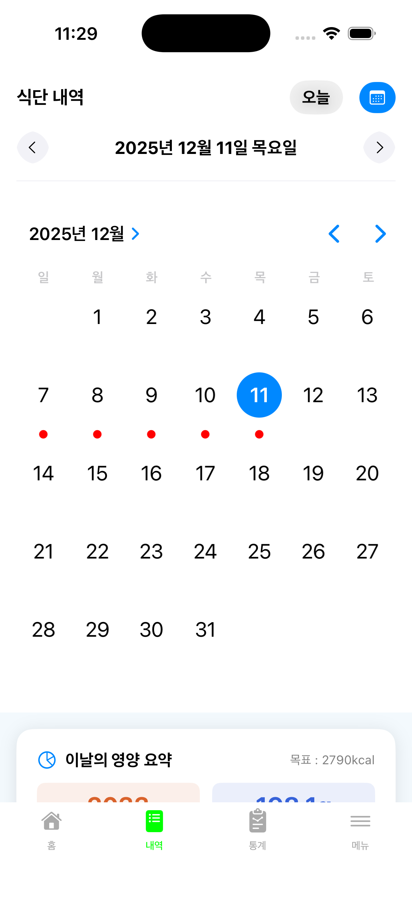
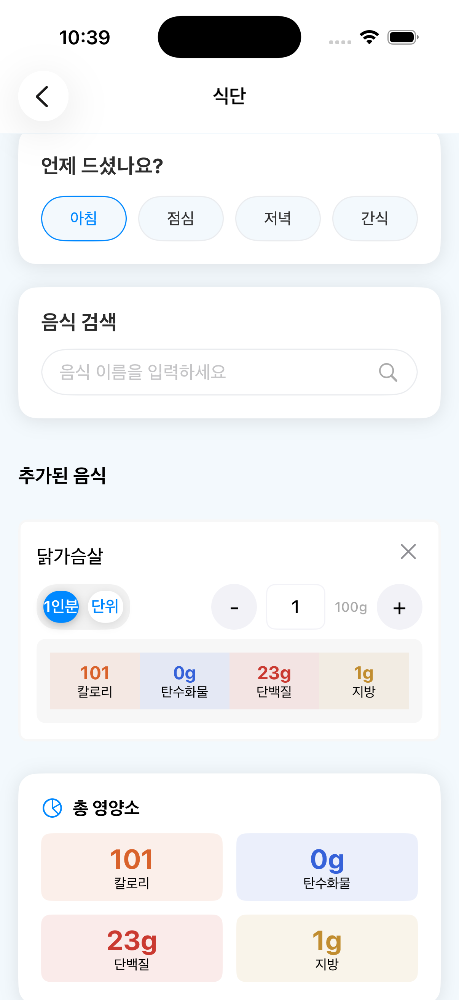
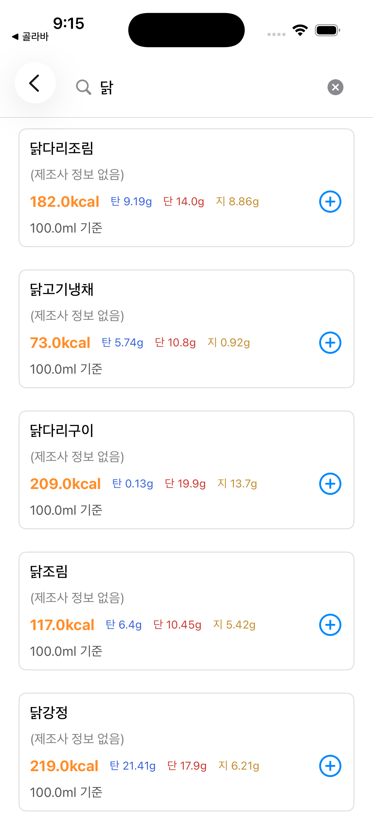
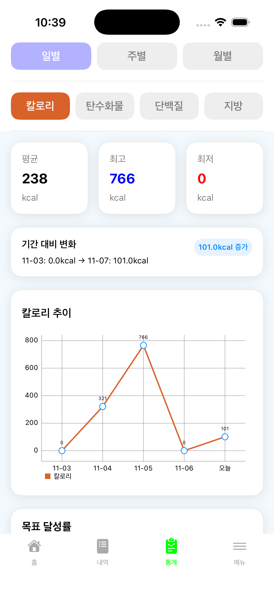
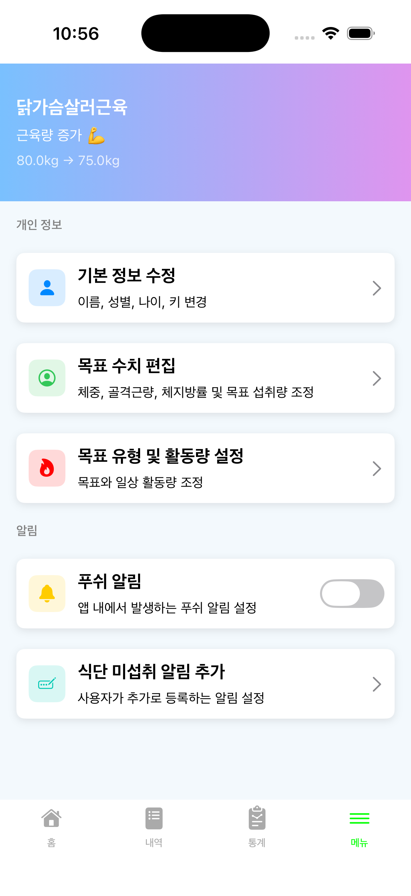
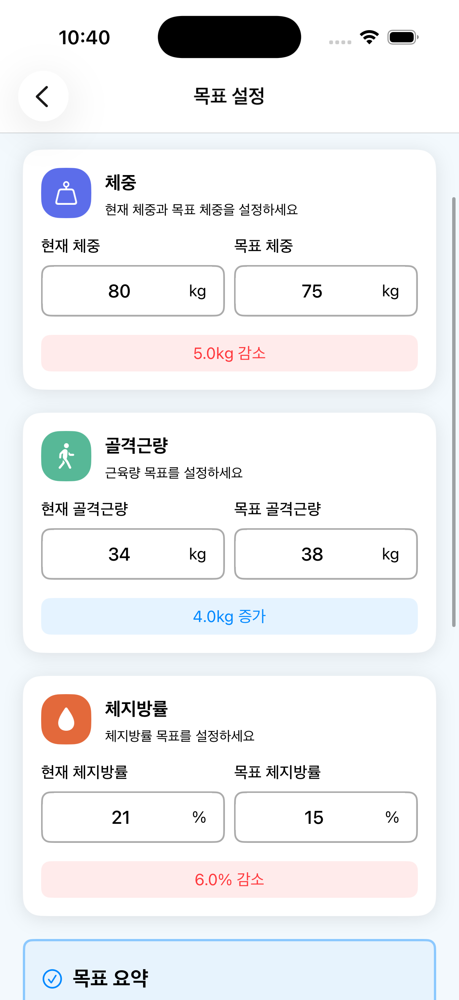
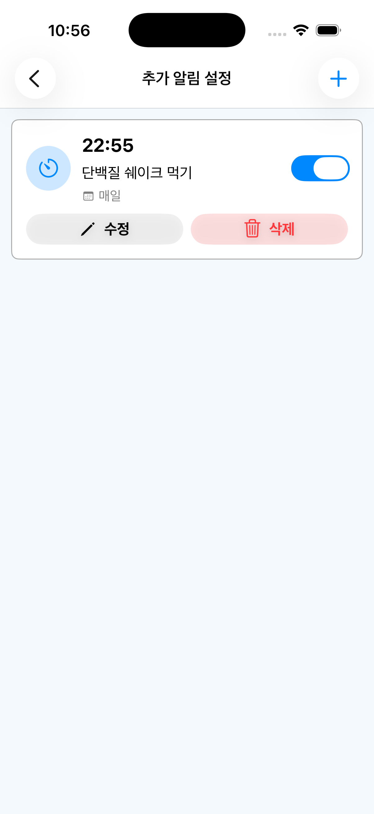
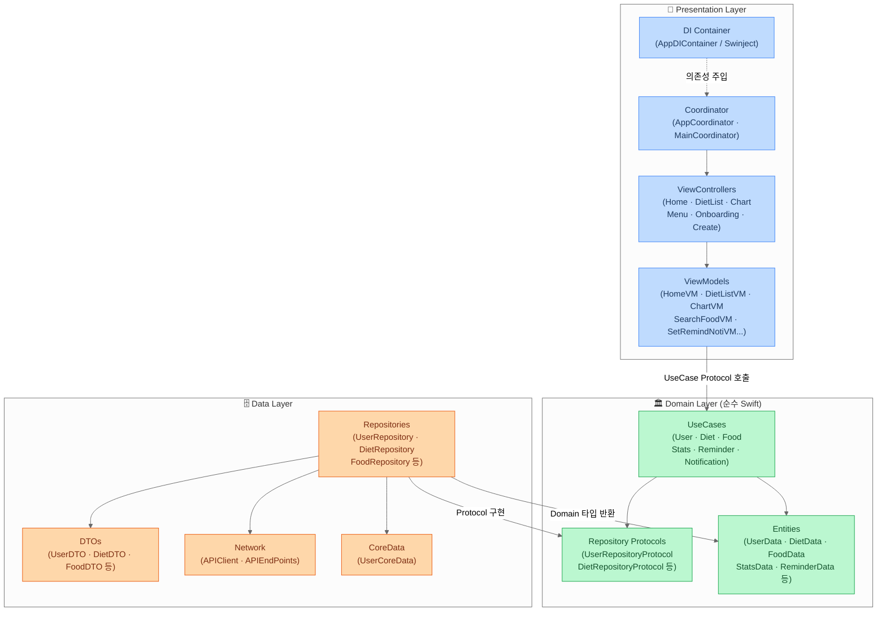

# BalanceEat

> 체중, 골격근량, 체지방률 기반 식단 기록 및 영양 목표 관리 iOS 앱

  

[](https://apps.apple.com/us/app/balanceeat/id6754953745)

<br>

## 스크린샷

| 홈 | 식단 내역 | 캘린더 |
|:---:|:---:|:---:|
|  |  |  |

| 식단 등록 | 음식 검색 | 통계 | 메뉴 |
|:---:|:---:|:---:|:---:|
|  |  |  |  |

| 목표 설정 | 알림 설정 |
|:---:|:---:|
|  |  |

<br>

## 주요 기능

| 기능 | 설명 |
|------|------|
| 홈 | 오늘의 칼로리 및 탄·단·지 섭취 현황 요약 |
| 식단 관리 | 아침/점심/저녁/간식별 식단 기록, 월별 캘린더 조회 |
| 음식 검색 | 음식 검색(페이징), 사용자 정의 음식 직접 등록 |
| 통계 | 기간별 영양소 섭취 통계 차트 |
| 리마인더 알림 | 요일·시간대 기반 반복 푸시 알림 |
| 사용자 설정 | 신체 정보, 목표 체중, 활동량, 영양 목표 수정 |
| 온보딩 | 최초 실행 시 튜토리얼 및 신체 정보·목표 설정 플로우 |

<br>

## 기술 스택

| 분류 | 사용 기술 |
|------|----------|
| 언어 | Swift |
| UI | UIKit, SnapKit |
| 아키텍처 | MVVM + Clean Architecture + Coordinator Pattern |
| 반응형 | RxSwift, RxCocoa |
| 비동기 | async/await, @MainActor |
| 네트워크 | Alamofire |
| 로컬 저장소 | CoreData, UserDefaults |
| 의존성 주입 | Swinject |
| 푸시 알림 | Firebase Cloud Messaging (FCM) |
| 차트 | DGCharts |
| 테스트 | XCTest |

<br>

## 아키텍처



**Coordinator Pattern**
- `AppCoordinator` → 온보딩 / 메인 플로우 분기
- 각 `ViewController`는 `onXxx: (() -> Void)?` 클로저로 화면 전환을 Coordinator에 위임
- `ViewController`에서 `AppDIContainer`를 직접 참조하지 않고, Coordinator가 의존성을 주입

**RxSwift + async/await 혼용 전략**
- `UseCase / Repository` 레이어: `async/await` — 일회성 비동기 작업에 적합
- `ViewModel`: `@MainActor async` 함수로 네트워크 호출 후 결과를 `Relay`에 저장
- `ViewController`: `Task { await viewModel.xxx() }` + RxSwift 구독으로 UI 업데이트

<br>

## 프로젝트 구조

```
BalanceEat/
├── AppDelegate.swift
├── SceneDelegate.swift
├── Coordinator/                # AppCoordinator, MainCoordinator
├── DI/                         # AppDIContainer (Swinject)
├── Core/
│   └── Presentation/
│       └── Components/         # 공통 UI 컴포넌트
├── Domain/
│   ├── Entities/
│   ├── Models/
│   ├── Repositories/           # Repository Protocols
│   └── UseCases/
├── Data/
│   ├── Network/                # APIClient, APIEndPoints
│   ├── Repository/
│   ├── DTOs/
│   └── CoreData/
├── Presentation/
│   ├── Base/                   # BaseViewController, BaseViewModel
│   ├── Onboarding/
│   ├── Create/                 # 식단 등록, 음식 검색/생성
│   └── Main/
│       ├── Home/
│       ├── List/               # 식단 캘린더
│       ├── Chart/              # 통계
│       └── Menu/               # 사용자 설정, 리마인더
├── Extension/
├── Resources/
└── Utils/
```

<br>

## 테스트

XCTest 기반 ViewModel 단위 테스트 **103개** 작성

- `MockUseCase`로 네트워크 의존성 격리
- Given / When / Then 구조로 성공·실패·로딩 흐름 전 케이스 검증
- 테스트 대상: `HomeViewModel`, `DietListViewModel`, `ChartViewModel`, `SearchFoodViewModel`, `SetRemindNotiViewModel` 등

<br>

## 트러블슈팅

### 1. ViewController에 비즈니스 로직 집중으로 인한 유지보수 어려움
- **문제**: 영양소 합산, 입력 유효성 검사, 날짜 포맷 변환 등 로직이 VC에 직접 구현되어 역할이 뒤섞임
- **해결**: 각 화면의 로직을 ViewModel로 이동, VC는 UI 바인딩만 담당하도록 분리
- **결과**: ViewModel 단독 테스트 가능, 기능 추가 시 변경 범위 명확화

### 2. RxSwift 구독 누적으로 인한 메모리 누수
- **문제**: `viewWillAppear`에서 바인딩 설정 시 화면이 나타날 때마다 구독이 쌓임
- **해결**: `presentationBag = DisposeBag()`을 도입해 화면 진입마다 이전 구독 해제, 일회성 이벤트는 `.take(1)` 적용
- **결과**: 메모리 누수 해소, 구독 관리 안정성 향상

### 3. FCM 토큰 갱신 시 기기 중복 등록 문제
- **문제**: 앱 재설치나 토큰 갱신 시 서버에 동일 기기가 중복 등록될 수 있었음
- **해결**: `UserDefaults`에 저장된 이전 토큰과 비교해 변경 시에만 서버에 등록 요청
- **결과**: 기기 중복 등록 없는 안정적인 토큰 관리 구현
